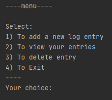

# JournalWithPythonSQL 
> This program gives user 4 options: 
1) To add a new log entry
2) To view your entries
3) To delete entry
4) To Exit 

> All data is stored in created "data.db" file whenever we run program and do some action like adding or deleting entry(if there is any entry).

## Table of contents
* [General info](#general-info)
* [Screenshots](#screenshots)
* [What I Learned](#what-i-learned)
* [Technologies](#technologies)
* [Status](#status)
* [Inspiration](#inspiration)
* [Contact](#contact)

## General Info

The project is very alike JournalWithPythonSQL, but i wanted to make something else using similiar structure and solidyfy by writting it from scratch. Also i want to improve
this program more adding some more functionality to it in some time.

## Screenshots

## What I Learned

1.Confidence in writting similiar programs.

2.Separating program into neat functions and files.

3.Usage of DB Browser (SQLite)

## Technologies
* Python  - version 3.8.5
* git     - version 2.27.0.windows.1
* PyCharm - 2020.1.1
* Windows 10
* DB Browser (SQLite)

## Status
Project is: _Left to be improved in some time_. 

## Inspiration
Udemy course: The Complete Python/PostgreSQL Course 2.0.

This course gave me very comprehensive knowledge about databases.

## Contact
Created by [@Luksos9](https://github.com/Luksos9) [@E-mail](lukaszszumilas.9@wp.pl) - feel free to contact me!

