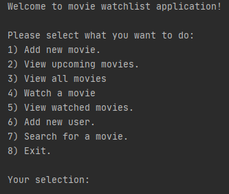

# MovieWatchList

> Program keeps track of movies the user is intrested in, and their release dates which he can input by himself.

> Stores which movie the user has already watched

> Adds new users to keep track of their watched movies separately

> Program is same as MovieWatchList, the difference is that it uses PostgreSQL as database instead of SQLite.

1) Add new movie.
2) View upcoming movies.
3) View all movies
4) Watch a movie
5) View watched movies.
6) Add new user.
7) Search for a movie.
8) Exit.

## Table of contents
* [General info](#general-info)
* [Setup](#setup)
* [Screenshots](#screenshots)
* [What I Learned](#what-i-learned)
* [Technologies](#technologies)
* [Status](#status)
* [Inspiration](#inspiration)
* [Contact](#contact)

## General Info

Purpose of this project was increasing my PostgreSQL knowledge, throught something practical. Program works same as MovieWatchList, but i changed it's database to get familiar with doing such action.

## Setup

This program uses PostgreSQL, so in file: _.env.example_ in environmental variable DATA_URL= ,there should putted a URL link to Postgre database. I didn't share mine to make it safe from changes, as if i didn't everyone could then go into it and delete all it's content.

## Screenshots

## What i learned?

1. To do not reinvent the wheel (I imported needed features from my previous project)

2. How to extract needed data from database using SELECT/WHERE

3. How to select data from multiple tables at the same time using JOIN.

4. How to use UPDATE queries and PRIMARY/FOREGIN KEYS.

5. Using efficiently datetime module and it's classes / functions.

6. Splitting tables to support multiple users.

7. How to separate project into different parts and testing them.

8. What are binary trees and how they work, what are indexes in SQL, how to create them and how they affect performance. I added it in this program.

## Technologies

* Python  - version 3.8.5
* git     - version 2.27.0.windows.1
* PyCharm - 2020.1.4
* Windows 10
* DB Browser (SQLite)

## Status
Project is: _currently finished but I think im going to develop it some more in some time_. 

## Inspiration
Project inspired by Jose Salvatierra.Founder of Teclado and Software Engineer.
Based on his Udemy course: The Complete Python/PostgreSQL Course 2.0.

I found this course really valuable and helpful in developing my Python and databases skills.
Sincere thanks to the autor.

## Contact
Created by [@Luksos9](https://github.com/Luksos9)

**E-mail**: *lukaszszumilas9@wp.pl*, [@linkedIn](https://www.linkedin.com/in/łukasz-szumilas-5b48821aa/) - feel free to contact me!
